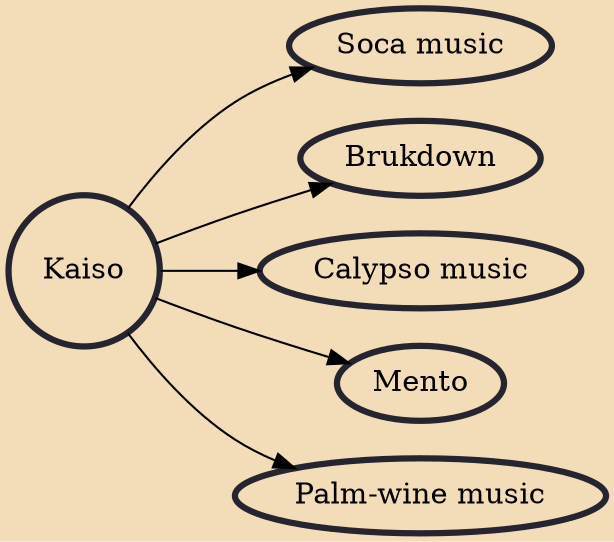

Kaiso is a type of music popular in Trinidad and Tobago, and other countries, especially of the Caribbean, such as Grenada, Belize, Barbados, St. Lucia and Dominica, which originated in West Africa particularly among the Efik and Ibibio people of Nigeria, and later evolved into calypso music. In Barbados, kaiso refers to a form of stage-presented calypso, such as at the crop over festival.

## Derivatives

- [[Soca music]]
- [[Brukdown]]
- [[Calypso music]]
- [[Mento]]
- [[Palm-wine music]]
