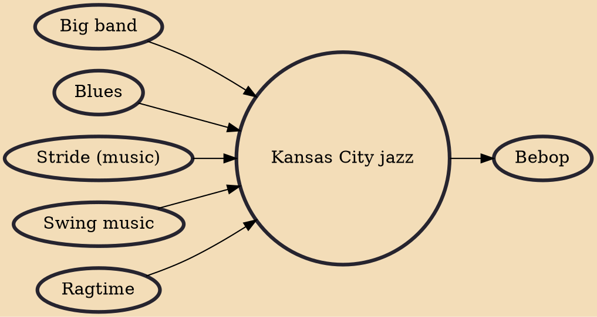

Kansas City jazz is a style of jazz that developed in Kansas City, Missouri during the 1920s and 1930s, which marked the transition from the structured big band style to the much more improvisational style of bebop. The hard-swinging, bluesy transition style is bracketed by Count Basie, who in 1929 signed with the Bennie Moten's Kansas City Orchestra, and Kansas City native Charlie Parker, who ushered in the bebop style in America. It has been said that while New Orleans was the birthplace of jazz, "America's music" grew up in Kansas City.

## Influences

- [[Big band]]
- [[Blues]]
- [[Stride (music)]]
- [[Swing music]]
- [[Ragtime]]

## Derivatives

- [[Bebop]]
