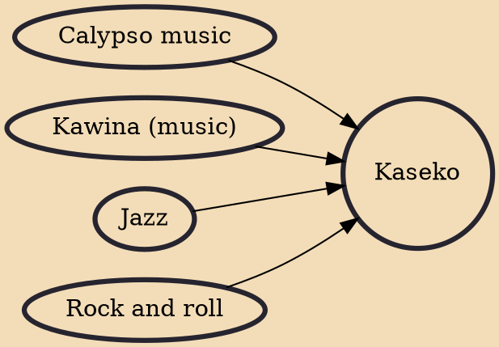

Kaseko is a musical genre from Suriname. It is a fusion of numerous popular and folk styles derived from Africa, Europe and the Americas. The genre is rhythmically complex, with percussion instruments including skratji (a very large bass drum) and snare drums, as well as saxophone, trumpet and occasionally trombone. Singing can be both solo and choir. Songs are typically call-and-response, as are Creole folk styles from the area, such as kawina.

## Influences

- [[Calypso music]]
- [[Kawina (music)]]
- [[Jazz]]
- [[Rock and roll]]
