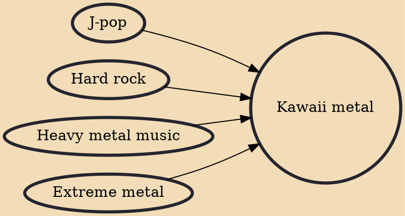

Kawaii metal (also known as idol metal, cute metal, J-pop metal or kawaiicore) is a musical genre that blends elements of heavy metal and J-pop that was pioneered in Japan in the early 2010s. The genre combines both Eastern and Western influences that appeal to both cultures. A typical kawaii metal composition combines the instrumentation found in various types of heavy metal music with J-pop melodies and a Japanese idol aesthetic. Kawaii metal's lyrical topics often contain kawaii (cute, lovable, kidlike) themes, making them much less hostile than those of other heavy metal genres.

## Influences
- [[J-pop]]
- [[Hard rock]]
- [[Heavy metal music]]
- [[Extreme metal]]
