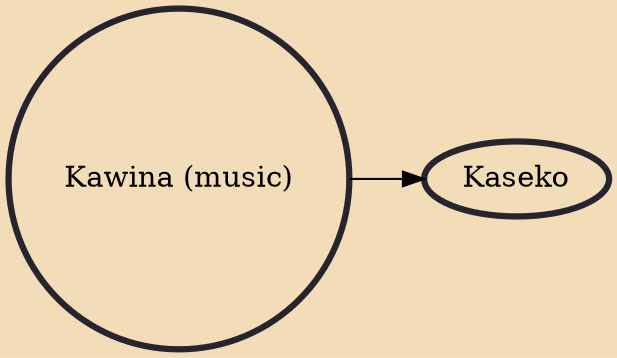

Kawina, also spelled kawna or kauna, is a musical genre from Suriname. It originated in the last decades of the 19th century under the influence of the music and dance forms banya, laku and tuka. It is related to African music.

## Derivatives
- [[Kaseko]]
