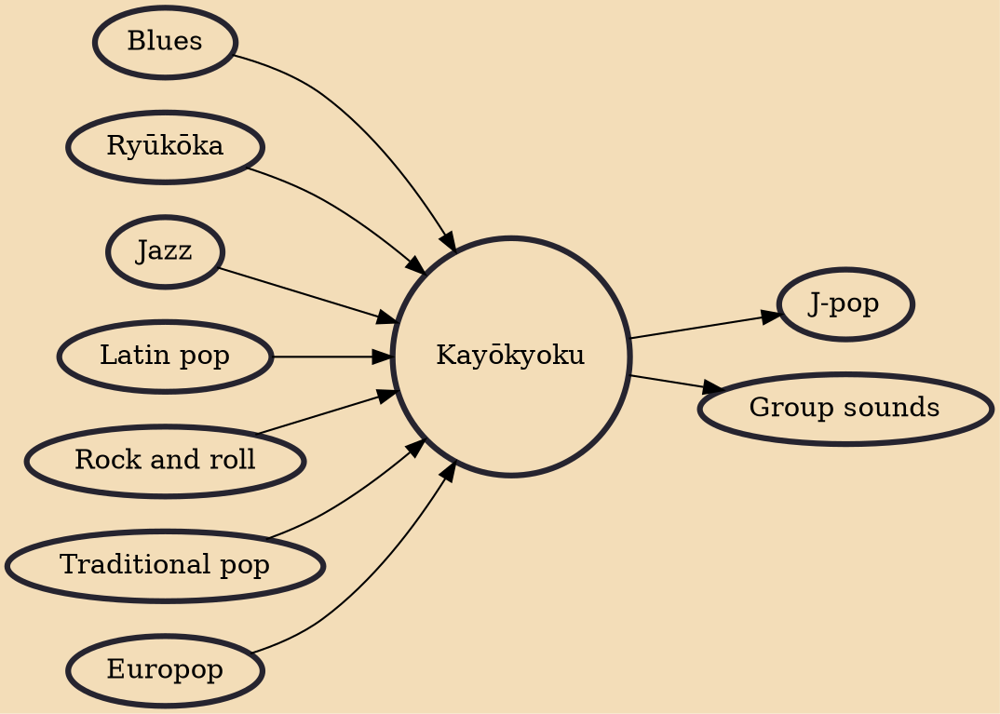

Kayōkyoku (歌謡曲, literally "Pop Tune") is a Japanese pop music genre, which became a base of modern J-pop. The Japan Times described kayōkyoku as "standard Japanese pop" or "Shōwa-era pop". Kayōkyoku represents a blend of Western and Japanese musical scales. Music in this genre is extremely varied as a result. Kayōkyoku in the narrower and more practical sense, however, excludes J-pop and enka. Unlike enka, kayōkyoku is also not based on emotional displays of effort while singing.

## Influences

- [[Blues]]
- [[Ryūkōka]]
- [[Jazz]]
- [[Latin pop]]
- [[Rock and roll]]
- [[Traditional pop]]
- [[Europop]]

## Derivatives

- [[J-pop]]
- [[Group sounds]]
