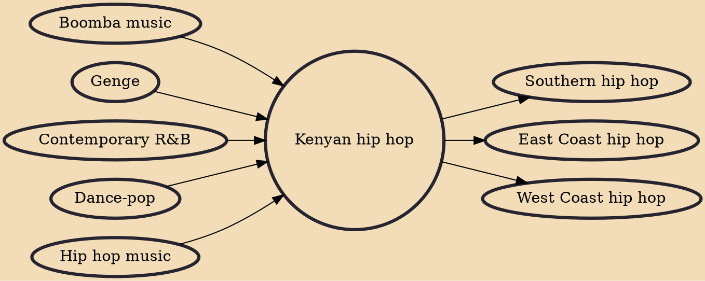

Kenyan hip hop is a genre of music and a culture that covers various forms and subgenres of hip-hop and rap originating from Kenya. It is commonly a combination of Swahili and English (Kenya's official languages) as well as Sheng and a variety of tribal languages.

## Influences

- [[Boomba music]]
- [[Genge]]
- [[Contemporary R&B]]
- [[Dance-pop]]
- [[Hip hop music]]

## Derivatives

- [[Southern hip hop]]
- [[East Coast hip hop]]
- [[West Coast hip hop]]
