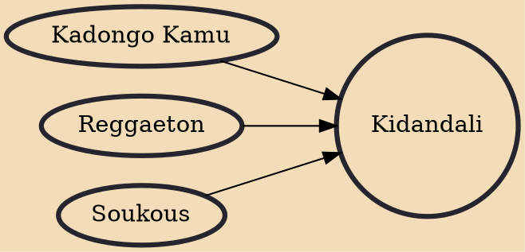

Kidandali is a stylistic music genre featuring the use of native sounds and samples from Uganda. Kidandali is a word from the Ganda language which in translation can mean "local party" or "celebration". Music concerts and traditional wedding ceremonies (kwanjula) are examples of such "bidandali". The music itself is given this name because most times it is the kind of music played or performed at such local parties and functions. Some other sources and commentators refer to the genre alternatively as "Band music" while others refer to it as "Afrobeats" or "Afro house".

## Influences
- [[Kadongo Kamu]]
- [[Reggaeton]]
- [[Soukous]]
