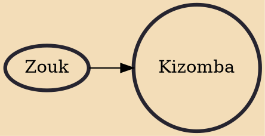

```dot
digraph {
	graph [bgcolor="#F3DDB8" rankdir=LR]
	node [color="#26242F" penwidth=3.0]
	Kizomba [shape=circle]
	Zouk [URL="/zouk/"]
	Zouk -> Kizomba
}
```

Kizomba is a dance and musical genre that originated in Angola in 1984. Kizomba means "party" in Kimbundu, a Bantu language spoken by the Ambundu in Angola.

## Influences

- [[Zouk]]
