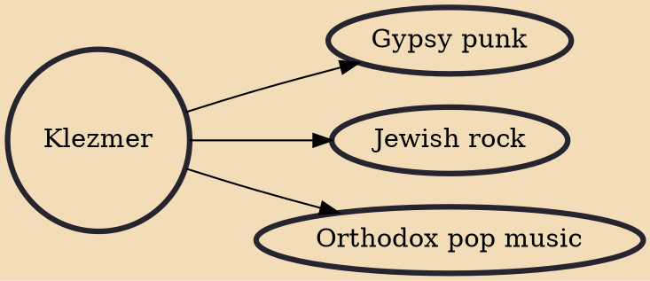

Klezmer (Yiddish: קלעזמער or כּלי־זמר) is an instrumental musical tradition of the Ashkenazi Jews of Central and Eastern Europe. The essential elements of the tradition include dance tunes, ritual melodies, and virtuosic improvisations played for listening; these would have been played at weddings and other social functions. The musical genre incorporated elements of many other musical genres including Ottoman (especially Greek and Romanian) music, Baroque music, German and Slavic folk dances, and religious Jewish music. As the music arrived in the United States, it lost some of its traditional ritual elements and adopted elements of American big band and popular music. Among the European-born klezmers who popularized the genre in the United States in the 1910s and 1920s were Dave Tarras a

## Derivatives

- [[Gypsy punk]]
- [[Jewish rock]]
- [[Orthodox pop music]]
