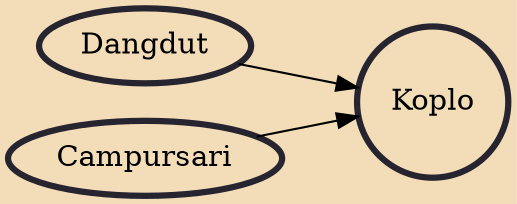

Koplo or dangdut koplo is a subgenre of dangdut, Indonesian popular dance & folk music, that originated in East Java during the early 2000s. The genre gets its name from the slang term "koplo" which refers to a hallucinogenic drug that is sold cheaply in Indonesia. Dangdut koplo is played at a faster tempo than the standard dangdut music and said to make listeners "feel high" thus gives the same effect of consuming koplo pills. Koplo also differs musically from the regular dangdut in the dominant role of the drummer, which plays more complex drum patterns.

## Influences

- [[Dangdut]]
- [[Campursari]]
