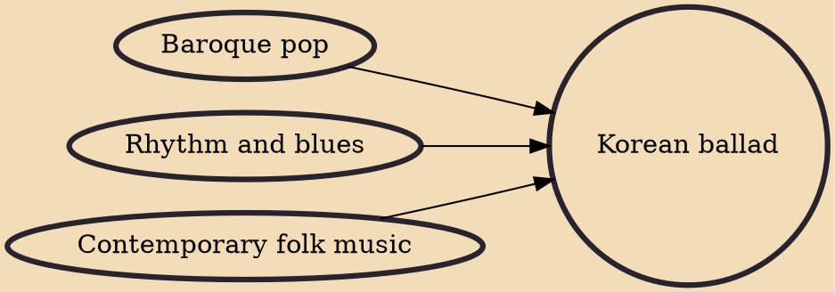

Korean ballad, also known as K-ballad (often simply referred to by South Koreans as ballad; Korean: 발라드), is a style of music in South Korea and a genre in which soul and rhythm and blues music is transformed to suit Korean sentiment. It became popular in the 1980s, and has influenced and evolved into many different music styles.

## Influences
- [[Baroque pop]]
- [[Rhythm and blues]]
- [[Contemporary folk music]]
