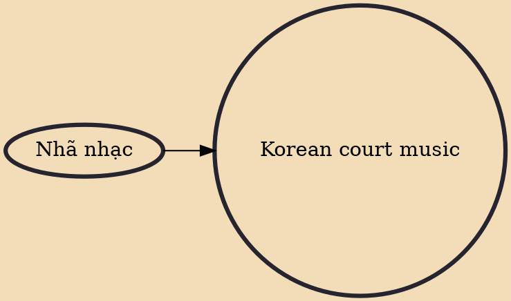

Korean court music comprises three main musical genres: aak, an imported form of Chinese ritual music; a pure Korean form called hyangak; and a combination of Chinese and Korean styles called dangak. Korean court music and its historical origins have been traced back to the Goryeo (918-1392) and Joseon dynasties (1392–1910). It was partly modelled on the court music of China, known as yayue. Korean court music also has similarities with the court music of Japan, known as gagaku and of Vietnam, known as nhã nhạc.

## Influences

- [[Nhã nhạc]]
