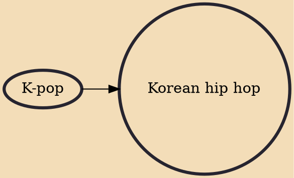

Korean hip hop, also known as K-hip hop or K-rap, is a subgenre of Korean popular music. It is widely considered to have originated in the late 1980s and early 1990s, and has since become increasingly popular, both in Korea and abroad. While Korea's hip hop culture includes various elements such as rap, graffiti, DJing, turntablism, and b-boying, rapping comprises a significant part of the culture. The term "hip hop" is largely recognized and understood as "rap" in Korea.

## Influences

- [[K-pop]]
