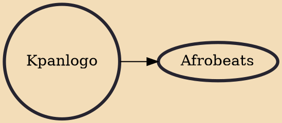

```dot
digraph {
	graph [bgcolor="#F3DDB8" rankdir=LR]
	node [color="#26242F" penwidth=3.0]
	Kpanlogo [shape=circle]
	Afrobeats [URL="/afrobeats/"]
	Kpanlogo -> Afrobeats
}
```

Kpanlogo is a recreational dance and music form originating from the 1960s among urban youth in Accra, Ghana.

## Derivatives
- [[Afrobeats]]
