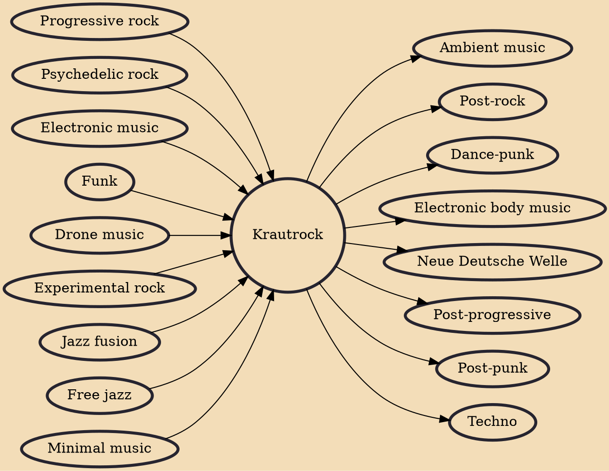

Krautrock (also called kosmische Musik, German for "cosmic music") is a broad genre of experimental rock that developed in West Germany in the late 1960s and early 1970s among artists who blended elements of psychedelic rock, avant-garde composition, and electronic music, among other eclectic sources. These artists incorporated hypnotic rhythms, extended improvisation, musique concrète techniques, and early synthesizers, while generally moving away from the rhythm & blues roots and song structure found in traditional Anglo-American rock music. Prominent groups associated with the krautrock label included Neu!, Can, Faust, Tangerine Dream, Kraftwerk, Cluster, Ash Ra Tempel, Popol Vuh, Amon Düül II and Harmonia.

## Influences

- [[Progressive rock]]
- [[Psychedelic rock]]
- [[Electronic music]]
- [[Funk]]
- [[Drone music]]
- [[Experimental rock]]
- [[Jazz fusion]]
- [[Free jazz]]
- [[Minimal music]]

## Derivatives

- [[Ambient music]]
- [[Post-rock]]
- [[Dance-punk]]
- [[Electronic body music]]
- [[Neue Deutsche Welle]]
- [[Post-progressive]]
- [[Post-punk]]
- [[Techno]]
