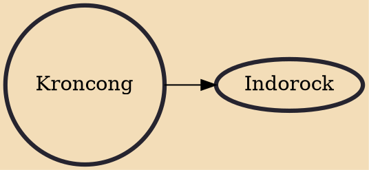

Kroncong (pronounced "kronchong"; Indonesian: Keroncong, Dutch: Krontjong) is the name of a ukulele-like instrument and an Indonesian musical style that typically makes use of the kroncong (the sound chrong-chrong-chrong comes from this instrument, so the music is called kroncong). A kroncong orchestra or ensemble traditionally consists of a flute, a violin, at least one, but usually a pair of kroncongs, a cello in pizzicato style, string bass in pizzicato style, and a vocalist.Kroncong originated as an adaptation of a Portuguese musical tradition, brought by sailors to Indonesian port cities in the 16th century. By the late 19th century, kroncong reached popular music status throughout the Indonesian archipelago.

## Derivatives
- [[Indorock]]
