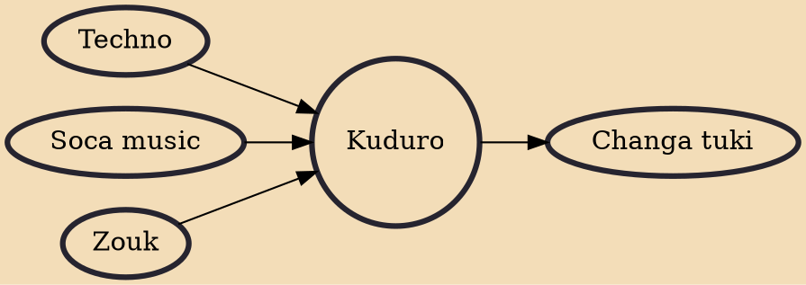

Kuduro (or kuduru) is a type of music and dance from Angola. It is characterized as uptempo, energetic, and danceable. Kuduro was developed in Luanda, Angola in the late 1980s. Producers sampled traditional carnival music like soca and zouk béton ("hard" zouk) from the Caribbean to Angola, techno and accordion playing from Europe and laid this around a fast 4/4 beat. The kuduro is similar to the kizomba rhythm.

## Influences
- [[Techno]]
- [[Soca music]]
- [[Zouk]]

## Derivatives
- [[Changa tuki]]
