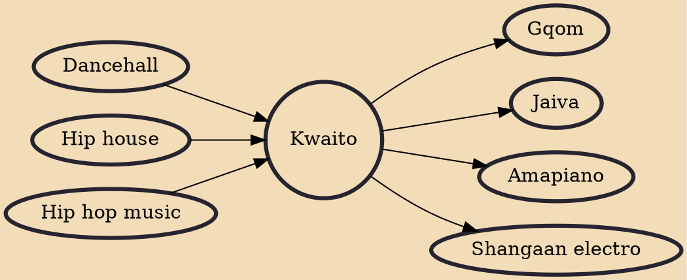

Kwaito is a music genre that emerged in Soweto, Johannesburg, South Africa, during the 1990s. It is a variant of house music that features the use of African sounds and samples. Kwaito songs occur at a slower tempo range than other styles of house music and Kwaito often contains catchy melodic and percussive loop samples, deep bass lines, and vocals. Despite its similarities to hip hop music, Kwaito has a distinctive manner in which the lyrics are sung, rapped and shouted.

## Influences

- [[Dancehall]]
- [[Hip house]]
- [[Hip hop music]]

## Derivatives

- [[Gqom]]
- [[Jaiva]]
- [[Amapiano]]
- [[Shangaan electro]]
