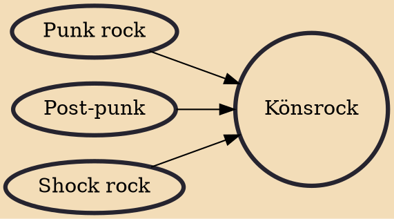

Könsrock (Swedish for Genitalia rock) is a Swedish music genre characterized by off-color humor, dealing with subjects such as handicapped people, disorders and diseases, homosexuality, and Nazism, often with strong elements of toilet humor.

## Influences

- [[Punk rock]]
- [[Post-punk]]
- [[Shock rock]]
