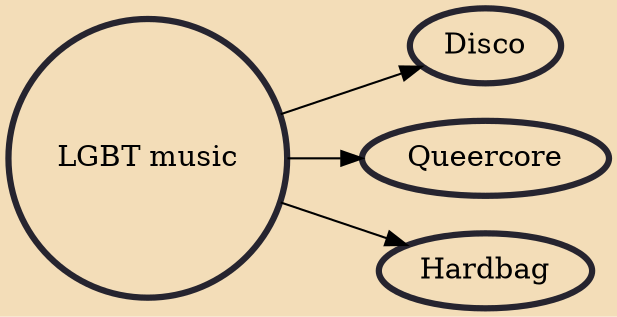

Lesbian, gay, bisexual, and transgender (LGBT+) music is music that focuses on the experiences of gender and sexual minorities as a product of the broad gay liberation movement. LGBT music spans the entire spectrum of popular music. Lyricism and song content typically express the frustration, anxiety, and hope associated with non-normative sexual and gender identities, offering marginalized groups a vital platform for expression. Recently, popular music has "provided an arena where marginalized voices can be heard and sexual identities shaped, challenged, and renegotiated." Mainstream music has begun to reflect acceptance of LGBT and queer musicianship.Some queer icons are openly queer identifying and have made impactful changes in the world for LGBT people. Others are straight allies that

## Derivatives
- [[Disco]]
- [[Queercore]]
- [[Hardbag]]
