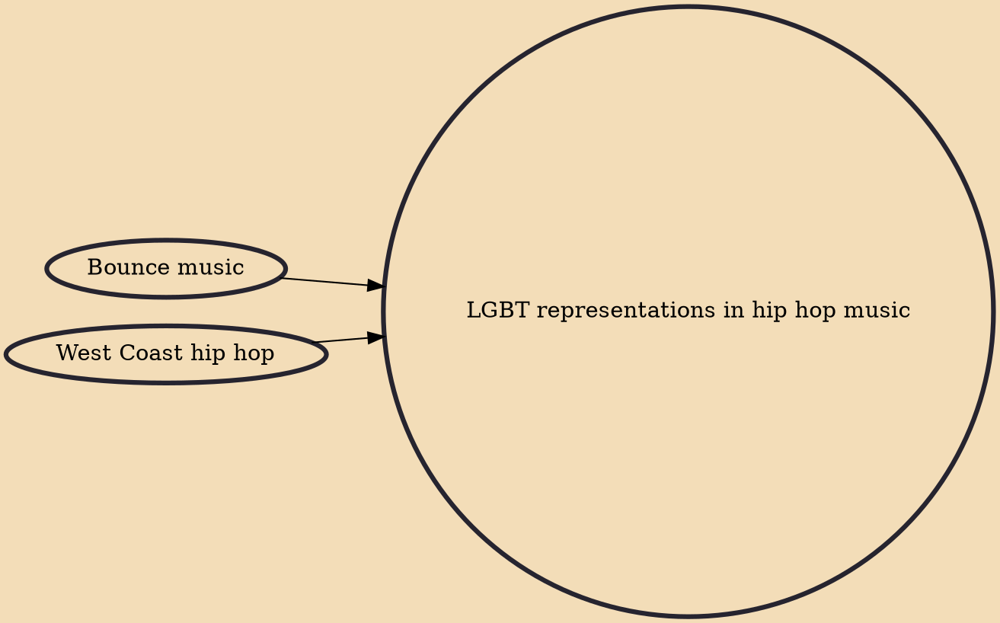

LGBT representations in hip hop music have existed since the birth of the genre despite blatant discrimination. Hip hop has long been portrayed as one of the least LGBT-friendly genres of music, with a significant body of the genre containing homophobic views and anti-gay lyrics, with mainstream artists such as Eminem and Tyler, the Creator having used homophobia in their lyrics. Attitudes towards homosexuality in hip hop culture have historically been negative. Slang that uses homosexuality as a punchline such as "sus", "no homo", and "pause" can be heard in hip hop lyrics from some of the industry's biggest artists. However, since the early 2000s there has been a flourishing community of LGBTQ+ hip hop artists, activists, and performers breaking barriers in the mainstream music industry.

## Influences
- [[Bounce music]]
- [[West Coast hip hop]]
