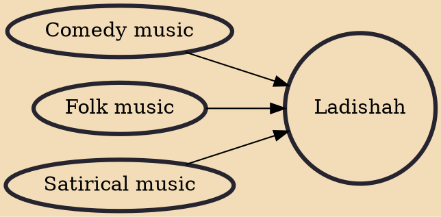

Ladishah (also spelled Ladi Shah or Laddi Shah) is a storytelling musical genre originated in Jammu and Kashmir with its roots in traditional and humorous folk singing originally sung by minstrels while locally wondering from one place to another. It is usually sung in Kashmiri language to express anguish or to entertain people in a rhythmic form primarily revolves around political, social and cultural issues in the form of ballad or melodious satire. It is identified when an entertainer raises their concerns in the form of humorous and melody singing without a voice break at some occurrences. It is sung with a musical instrument called dhukar, a traditional instrument consisting of two metal rods. Sometimes, an artist sings without a musical instrument.

## Influences

- [[Comedy music]]
- [[Folk music]]
- [[Satirical music]]
