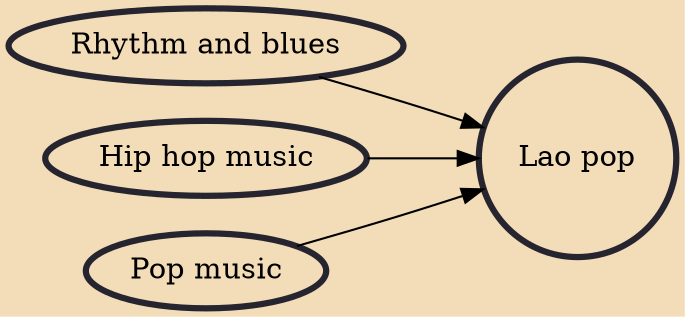

```dot
digraph {
	graph [bgcolor="#F3DDB8" rankdir=LR]
	node [color="#26242F" penwidth=3.0]
	"Lao pop" [shape=circle]
	"Rhythm and blues" [URL="/rhythm-and-blues/"]
	"Rhythm and blues" -> "Lao pop"
	"Hip hop music" [URL="/hip-hop-music/"]
	"Hip hop music" -> "Lao pop"
	"Pop music" [URL="/pop-music/"]
	"Pop music" -> "Lao pop"
}
```

Lao pop or L-pop is a music genre of pop music of Lao people.

## Influences

- [[Rhythm and blues]]
- [[Hip hop music]]
- [[Pop music]]
