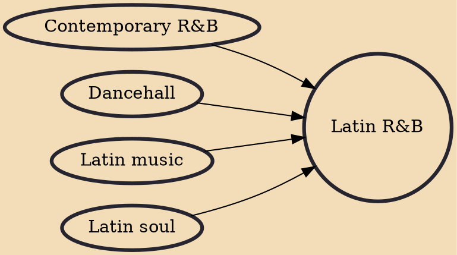

Latin R&B (also known as Spanish R&B) is a style of R&B that originated in Latin America and the United States. It is a musical subgenre of American contemporary R&B and Latin soul that also takes influence from dancehall. The genre began to gain popularity in the late 2010s and has since spread throughout Latin America.

## Influences

- [[Contemporary R&B]]
- [[Dancehall]]
- [[Latin music]]
- [[Latin soul]]
