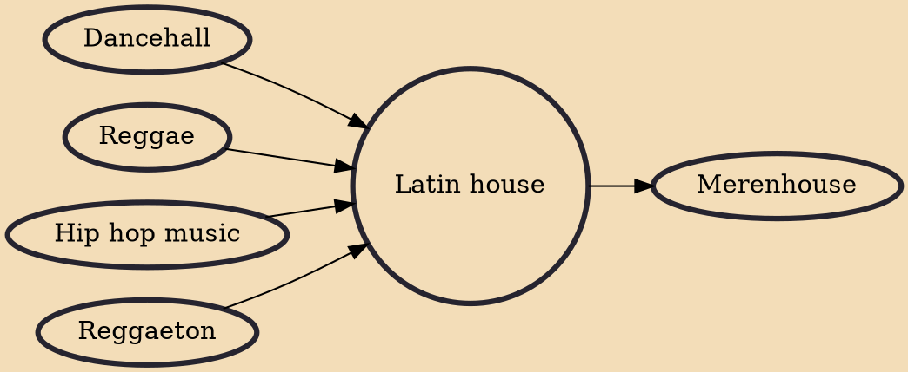

Latin house or Latin EDM is an electronic dance music genre that combines house and Latin American music, such as that of Puerto Rican, Cuban, Dominican, and African origin.

## Influences
- [[Dancehall]]
- [[Reggae]]
- [[Hip hop music]]
- [[Reggaeton]]

## Derivatives
- [[Merenhouse]]
