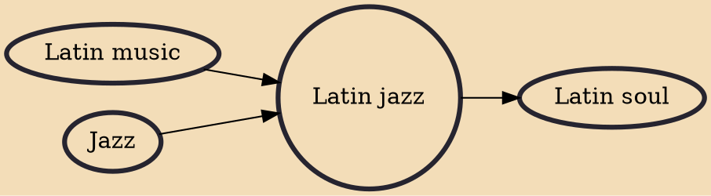

Latin jazz is a genre of jazz with Latin American rhythms. The two main categories are Afro-Cuban jazz, rhythmically based on Cuban popular dance music, with a rhythm section employing ostinato patterns or a clave, and Afro-Brazilian jazz, which includes samba and bossa nova.

## Influences

- [[Latin music]]
- [[Jazz]]

## Derivatives

- [[Latin soul]]
