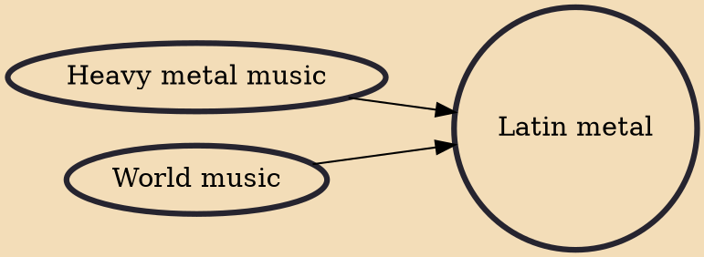

Latin metal (Spanish: metal latino, Portuguese: metal latino-americano) is a subgenre of heavy metal music with Latin origins, influences, and instrumentation, such as Spanish vocals, Latin percussion and rhythm such as Salsa rhythm. Some South American bands also add influences and instrumentations borrowed from world music and ethnic music, relating to musical traditions of the indigenous people of America.

## Influences
- [[Heavy metal music]]
- [[World music]]
