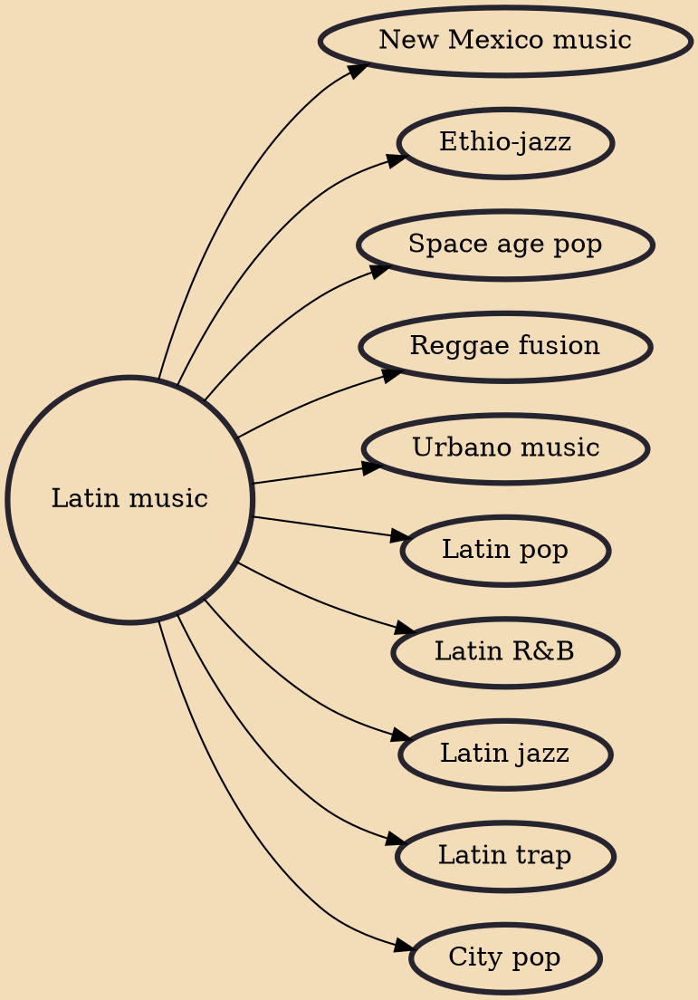

Latin music (Portuguese and Spanish: música latina) is a term used by the music industry as a catch-all category for various styles of music from Ibero-America (including Spain and Portugal) and the Latino United States inspired by Latin American, Spanish and Portuguese music genres, as well as music that is sung in either Spanish and/or Portuguese.

## Derivatives
- [[New Mexico music]]
- [[Ethio-jazz]]
- [[Space age pop]]
- [[Reggae fusion]]
- [[Urbano music]]
- [[Latin pop]]
- [[Latin R&B]]
- [[Latin jazz]]
- [[Latin trap]]
- [[City pop]]
