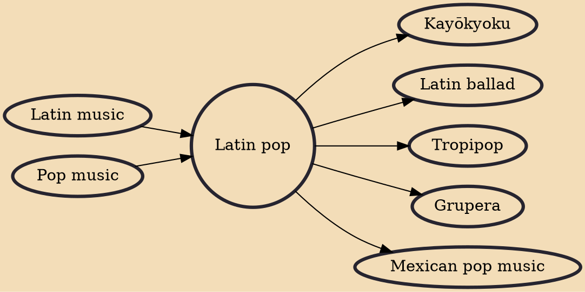

Latin pop (in Spanish and in Portuguese: Pop latino) is a pop music subgenre that is a fusion of US–style music production with Latin music genres from anywhere in Latin America and Spain. Originating in Spanish-speaking musicians, Latin pop may also be made by musicians in Portuguese (mainly in Brazilian Portuguese) and the various Romance Creole languages. Latin pop usually combines upbeat Latin music with American pop music. Latin pop is commonly associated with Spanish-language pop, rock, and dance music.

## Influences

- [[Latin music]]
- [[Pop music]]

## Derivatives

- [[Kayōkyoku]]
- [[Latin ballad]]
- [[Tropipop]]
- [[Grupera]]
- [[Mexican pop music]]
