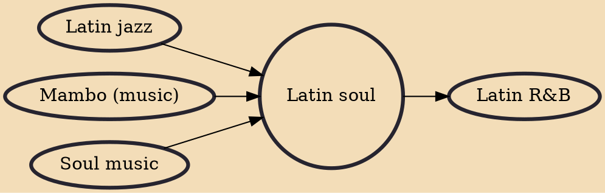

Latin soul (sometimes used synonymously with Boogaloo) was a short-lived musical genre that had developed in the 1960s in New York City. It had consisted of a blend of Cuban mambo with elements of Latin jazz and soul music. Although short-lived, the genre had a very great influence on the growing Salsa movement which would dominate the New York Latin music scene in the 1970s. Today, the term is typically used by Hispanic and Latino artists producing R&B and/or soul music.

## Influences
- [[Latin jazz]]
- [[Mambo (music)]]
- [[Soul music]]

## Derivatives
- [[Latin R&B]]
