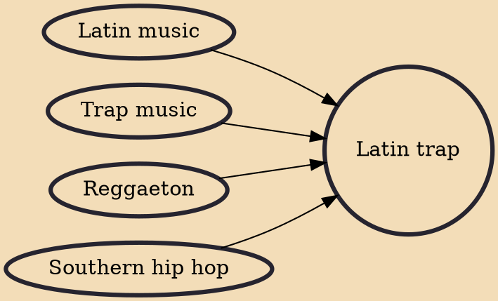

Latin trap is a subgenre of trap music that originated in Puerto Rico. A direct descendant of southern hip hop, and influenced by reggaeton, it gained popularity after 2007, and has since spread throughout Latin America. The trap is slang for a place where drugs are sold. Latin trap is similar to mainstream trap with lyrics about life on la calle (the street), drugs, sex and violence, without censorship.

## Influences
- [[Latin music]]
- [[Trap music]]
- [[Reggaeton]]
- [[Southern hip hop]]
