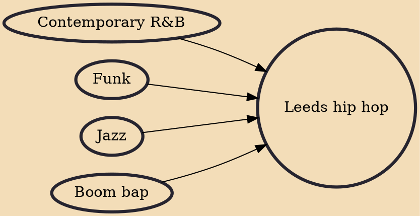

Leeds hip hop or New Yorkshire hip hop is the style of hip hop found in the epicentre of the New Yorkshire hip-hop movement that originated in West Yorkshire, England during the 2000s. Leeds hip hop has been noted as a revival of the purist forms of underground hip-hop and stylised by adopting classic elements of East Coast sounds which complement the Leeds underground.

## Influences
- [[Contemporary R&B]]
- [[Funk]]
- [[Jazz]]
- [[Boom bap]]
