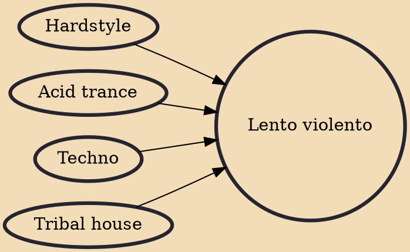

Lento violento, sometimes shortened to simply lento, is a style of electronic dance music that developed in Italy. Its name means slow (and) violent, as this style typically has a tempo between 85 and 115 BPM. It consists of a hard kick, like the ones present in hardcore or hardstyle, but played at a very slow tempo, with vocal samples and dark and acid sounds or loops.

## Influences
- [[Hardstyle]]
- [[Acid trance]]
- [[Techno]]
- [[Tribal house]]
