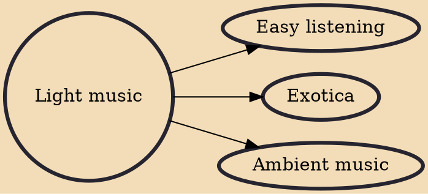

Light music is a less-serious form of Western classical music, which originated in the 18th and 19th centuries and continues today. Its heyday was in the mid‑20th century. The style is through-composed, usually shorter orchestral pieces and suites designed to appeal to a wider context and audience than more sophisticated forms such as the concerto, the symphony and the opera. Light music was especially popular during the formative years of radio broadcasting, with stations such as the BBC Light Programme (1945–1967) playing almost exclusively "light" compositions.

## Derivatives

- [[Easy listening]]
- [[Exotica]]
- [[Ambient music]]
