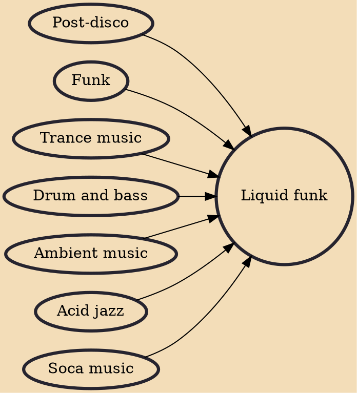

Liquid funk, liquid drum & bass, liquid DnB, melodic drum & bass, or sometimes just liquid is a subgenre of drum and bass. While it uses similar basslines and bar layouts to other styles, it contains fewer bar-oriented samples and more instrumental layers (both synthesized and natural), harmonies, melodies and ambiance, producing a sentimental atmosphere directed at home listeners as well as nightclub and rave audiences. Music genres such as jazz, soul and sometimes blues have a pivotal influence on liquid funk.

## Influences

- [[Post-disco]]
- [[Funk]]
- [[Trance music]]
- [[Drum and bass]]
- [[Ambient music]]
- [[Acid jazz]]
- [[Soca music]]
