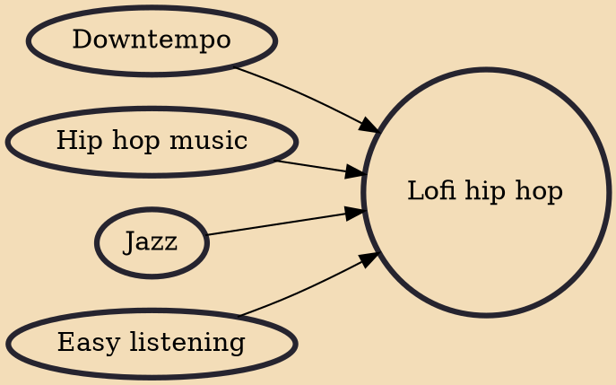

Lofi hip hop (also known as chillhop and lofi beats to study to) is a form of downtempo music that combines elements of hip hop and chill-out music. It was popularized in the 2010s on YouTube and has been referred to as an Internet meme.

## Influences

- [[Downtempo]]
- [[Hip hop music]]
- [[Jazz]]
- [[Easy listening]]
