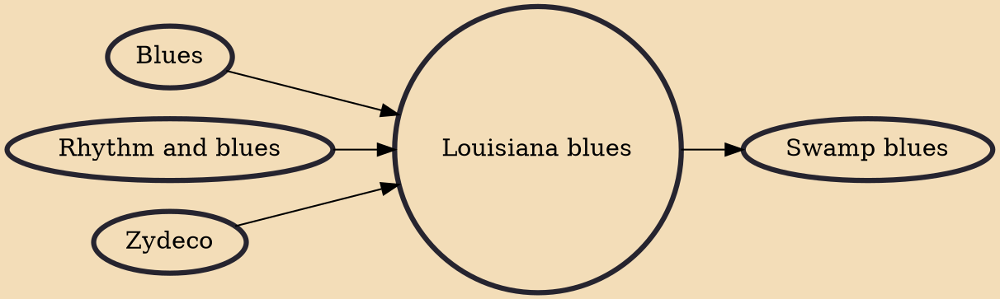

Louisiana blues is a genre of blues music that developed in the period after World War II in the state of Louisiana. It is generally divided into two major subgenres, with the jazz-influenced New Orleans blues based on the musical traditions of that city and the slower tempo swamp blues incorporating influences from zydeco and Cajun music from around Baton Rouge.

## Influences
- [[Blues]]
- [[Rhythm and blues]]
- [[Zydeco]]

## Derivatives
- [[Swamp blues]]
