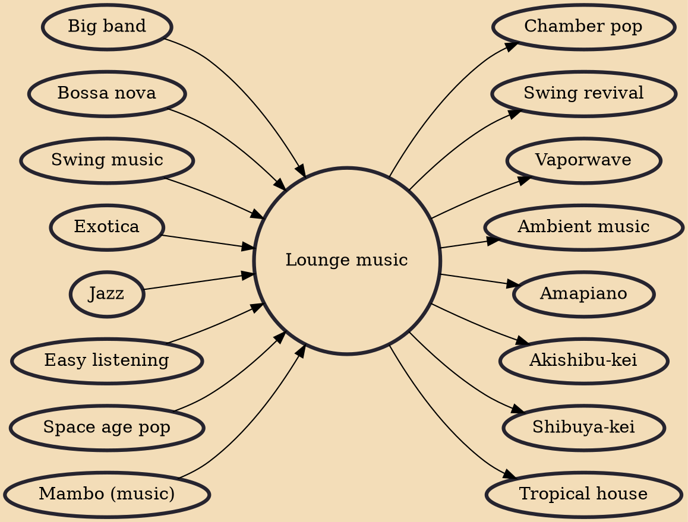

Lounge music is a type of easy listening music popular in the 1950s and 1960s. It may be meant to evoke in the listeners the feeling of being in a place, usually with a tranquil theme, such as a jungle, an island paradise or outer space. The range of lounge music encompasses beautiful music-influenced instrumentals, modern electronica (with chillout, and downtempo influences), while remaining thematically focused on its retro-space age cultural elements. The earliest type of lounge music appeared during the 1920s and 1930s, and was known as light music.

## Influences
- [[Big band]]
- [[Bossa nova]]
- [[Swing music]]
- [[Exotica]]
- [[Jazz]]
- [[Easy listening]]
- [[Space age pop]]
- [[Mambo (music)]]

## Derivatives
- [[Chamber pop]]
- [[Swing revival]]
- [[Vaporwave]]
- [[Ambient music]]
- [[Amapiano]]
- [[Akishibu-kei]]
- [[Shibuya-kei]]
- [[Tropical house]]
