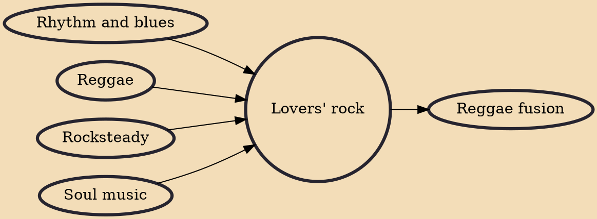

Lovers' rock is a style of reggae music noted for its romantic sound and content. While love songs had been an important part of reggae since the late 1960s, the style was given a greater focus and a name in London in the mid-1970s.

## Influences
- [[Rhythm and blues]]
- [[Reggae]]
- [[Rocksteady]]
- [[Soul music]]

## Derivatives
- [[Reggae fusion]]
