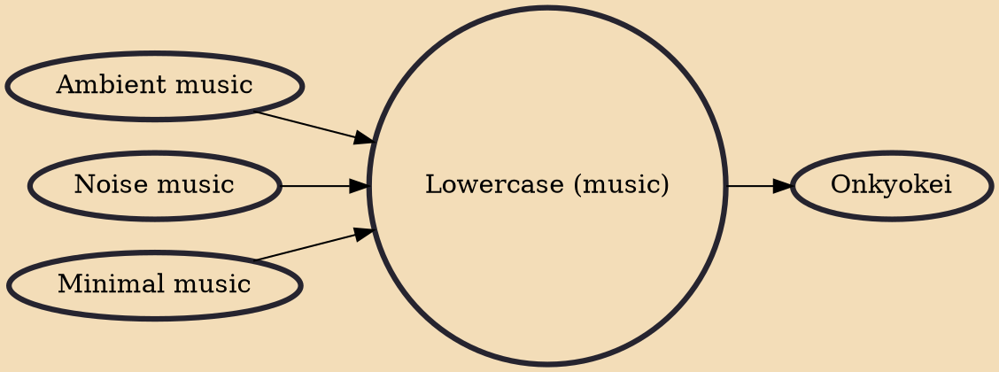

Lowercase is an extreme form of ambientminimalism where very quiet, usually unheard sounds are amplified to extreme levels. Minimal artist Steve Roden popularized the movement with an album entitled Forms of Paper, in which he made recordings of himself handling paper in various ways. These recordings were commissioned by the Hollywood branch of the Los Angeles Public Library.

## Influences
- [[Ambient music]]
- [[Noise music]]
- [[Minimal music]]

## Derivatives
- [[Onkyokei]]
