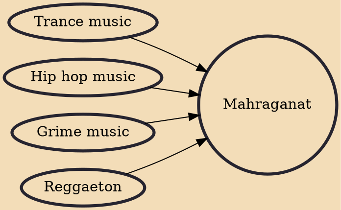

Mahragan, also Mahraganat (English: festivals, carnivals; Egyptian Arabic: مهرجانات Egyptian Arabic pronunciation: [mɑh.ɾɑ.ɡɑˈnɑːt]) or Egyptian Electro, also Egyptian Street Music is a popular genre of Egyptian Folk Music. Mahraganat is a combination of popular Egyptian Shaabi music played at weddings, EDM and Hip-Hop. DJ Figo made the genre more well known with his team "set dyaba" released during the 2011 Egyptian Revolution. Although this may be the first ever track to go mainstream, Mahraganat was conceived early by several Egyptian underground artists as DJ Ahmed Figo, El Sadat, Feelo and Alaa Fifty in 2004. They shared their music via MP3 files and phones, and it could be heard playing everywhere in taxis, tuktuks and on the street, since Egyptian Shaabi music has always been consid

## Influences
- [[Trance music]]
- [[Hip hop music]]
- [[Grime music]]
- [[Reggaeton]]
