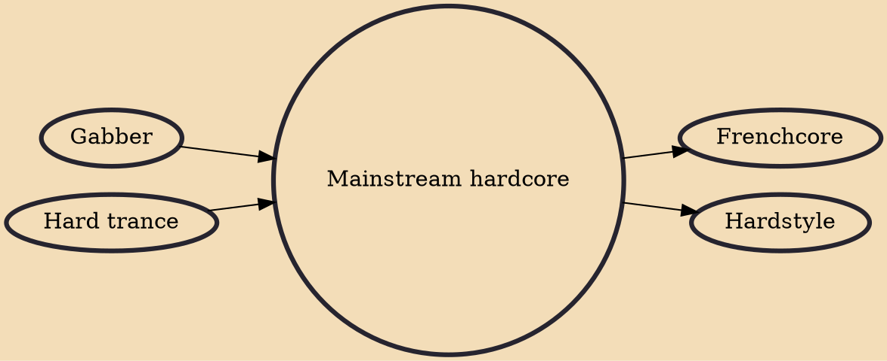

Mainstream hardcore, mainstyle, nu style gabber or newstyle hardcore is a subgenre of hardcore. The essence of mainstream hardcore sound is a distorted bass drum sound, overdriven to the point where it becomes clipped into a distorted square wave and makes a recognizably melodic tone.

## Influences

- [[Gabber]]
- [[Hard trance]]

## Derivatives

- [[Frenchcore]]
- [[Hardstyle]]
