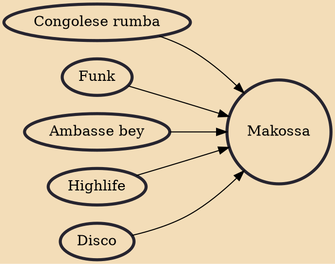

Makossa is a Cameroonian style of urban music. Like much other late 20th century music of Sub-Saharan Africa, it uses strong electric bass rhythms and prominent brass. In the 1980s makossa had a wave of mainstream success across Africa and to a lesser extent abroad. Makassi is a lighter style of makossa.

## Influences
- [[Congolese rumba]]
- [[Funk]]
- [[Ambasse bey]]
- [[Highlife]]
- [[Disco]]
