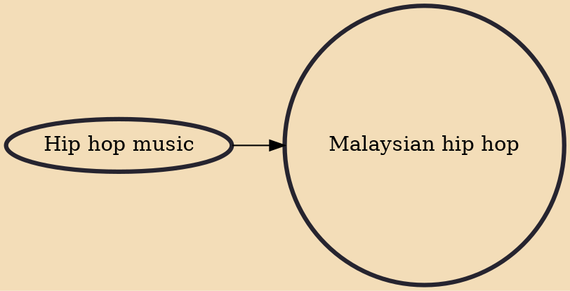

The Malaysian hip hop is a hip hop music performed in Malaysia. Many of Malaysian hip hop artistes performed songs mostly in English, but also rhymed in their native Malay language.

## Influences
- [[Hip hop music]]
