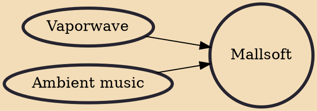

```dot
digraph {
	graph [bgcolor="#F3DDB8" rankdir=LR]
	node [color="#26242F" penwidth=3.0]
	Mallsoft [shape=circle]
	Vaporwave [URL="/vaporwave/"]
	Vaporwave -> Mallsoft
	"Ambient music" [URL="/ambient-music/"]
	"Ambient music" -> Mallsoft
}
```

Mallsoft (also known as mallwave) is a vaporwave subgenre themed after retro shopping malls.

## Influences
- [[Vaporwave]]
- [[Ambient music]]
