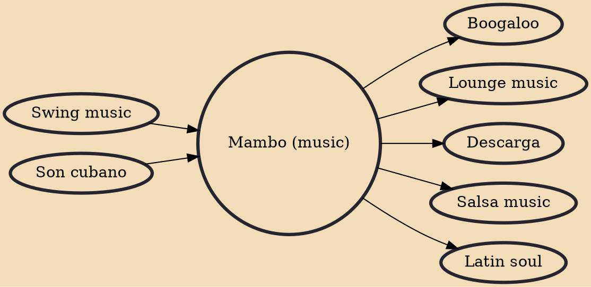

Mambo is a genre of Cuban dance music pioneered by the charanga Arcaño y sus Maravillas in the late 1930s and later popularized in the big band style by Pérez Prado. It originated as a syncopated form of the danzón, known as danzón-mambo, with a final, improvised section, which incorporated the guajeos typical of son cubano (also known as montunos). These guajeos became the essence of the genre when it was played by big bands, which did not perform the traditional sections of the danzón and instead leaned towards swing and jazz. By the late 1940s and early 1950s, mambo had become a "dance craze" in the United States as its associated dance took over the East Coast thanks to Pérez Prado, Tito Puente, Tito Rodríguez and others. In the mid-1950s, a slower ballroom style, also derived from the

## Influences
- [[Swing music]]
- [[Son cubano]]

## Derivatives
- [[Boogaloo]]
- [[Lounge music]]
- [[Descarga]]
- [[Salsa music]]
- [[Latin soul]]
