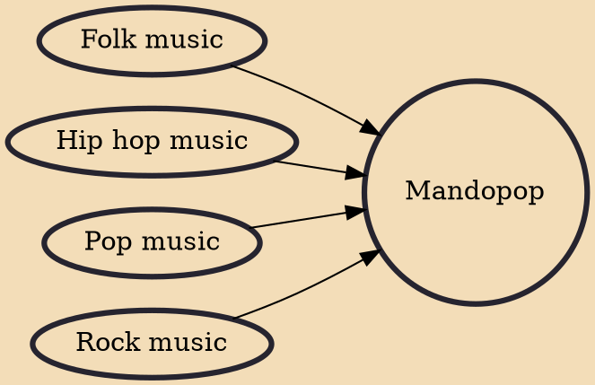

Mandopop or Mandapop refers to Mandarin popular music. The genre has its origin in the jazz-influenced popular music of 1930s Shanghai known as Shidaiqu; with later influences coming from Japanese enka, Hong Kong's Cantopop, Taiwan's Hokkien pop, and in particular the Campus Song folk movement of the 1970s. 'Mandopop' may be used as a general term to describe popular songs performed in Mandarin. Though Mandopop predates Cantopop, the English term was coined around 1980 after "Cantopop" became a popular term for describing popular songs in Cantonese. "Mandopop" was used to describe Mandarin-language popular songs of that time, some of which were versions of Cantopop songs sung by the same singers with different lyrics to suit the different rhyme and tonal patterns of Mandarin.

## Influences
- [[Folk music]]
- [[Hip hop music]]
- [[Pop music]]
- [[Rock music]]
