```dot
digraph {
	graph [bgcolor="#F3DDB8" rankdir=LR]
	node [color="#26242F" penwidth=3.0]
	"Mangue bit" [shape=circle]
	Electronica [URL="/electronica/"]
	Electronica -> "Mangue bit"
	Funk [URL="/funk/"]
	Funk -> "Mangue bit"
	"Alternative rock" [URL="/alternative-rock/"]
	"Alternative rock" -> "Mangue bit"
	"Forró" [URL="/forro/"]
	"Forró" -> "Mangue bit"
	Ragga [URL="/ragga/"]
	Ragga -> "Mangue bit"
	"Hip hop music" [URL="/hip-hop-music/"]
	"Hip hop music" -> "Mangue bit"
	"Coco (music)" [URL="/coco-music/"]
	"Coco (music)" -> "Mangue bit"
	"Soul music" [URL="/soul-music/"]
	"Soul music" -> "Mangue bit"
}
```

The mangue bit or manguebeat movement is a cultural movement created circa 1991 in the city of Recife in Northeast Brazil in reaction to the cultural and economic stagnation of the city. The movement largely focuses on music, but it has its own fashion and slang, and encompasses aspects of visual art. It mixes regional rhythms of Brazilian Northeast, such as maracatu, frevo, coco and forró, with rock, soul, raggamuffin, hip hop, funk and electronic music.

## Influences

- [[Electronica]]
- [[Funk]]
- [[Alternative rock]]
- [[Forró]]
- [[Ragga]]
- [[Hip hop music]]
- [[Coco (music)]]
- [[Soul music]]
