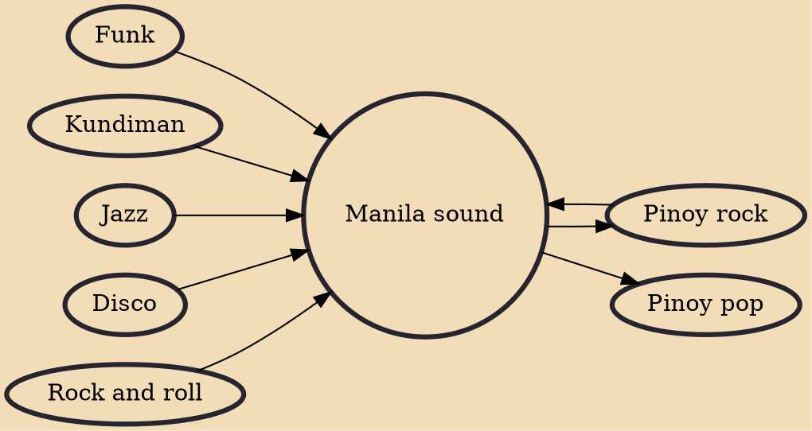

Manila sound is a music genre in the Philippines that began in the mid-1970s in Manila. The genre flourished and peaked in the mid to late-1970s during the Philippine martial law era and has influenced most of the modern genres in the country by being the forerunner to OPM.

## Influences

- [[Funk]]
- [[Kundiman]]
- [[Pinoy rock]]
- [[Jazz]]
- [[Disco]]
- [[Rock and roll]]

## Derivatives

- [[Pinoy pop]]
- [[Pinoy rock]]
